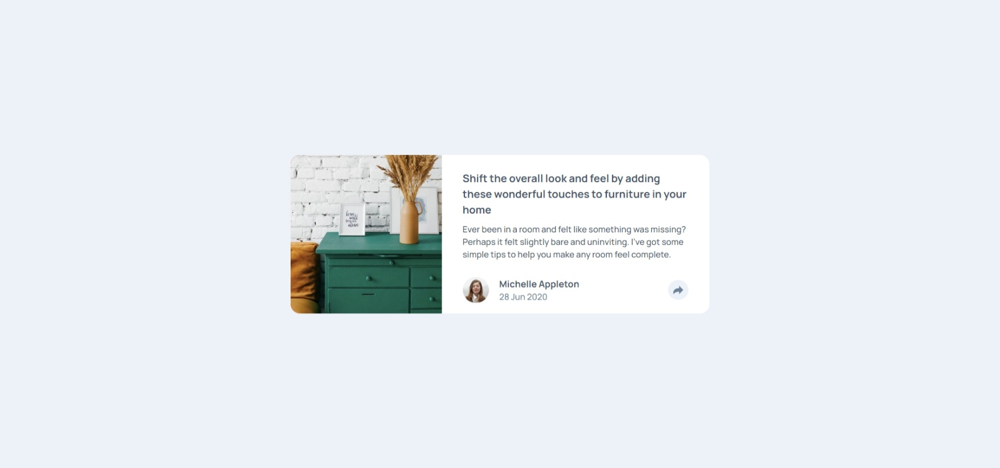

# Frontend Mentor - Article preview component solution

This is a solution to the [Article preview component challenge on Frontend Mentor](https://www.frontendmentor.io/challenges/article-preview-component-dYBN_pYFT). Frontend Mentor challenges help you improve your coding skills by building realistic projects.

### The challenge

Users should be able to:

- View the optimal layout for the component depending on their device's screen size
- See the social media share links when they click the share icon

### Screenshot

### Links

- Solution URL: [frontendmentor](https://www.frontendmentor.io/solutions/artice-preview-component-f4os4bSW7B)
- Live Site URL: [netlify](https://inspiring-lamington-09d8a3.netlify.app)
